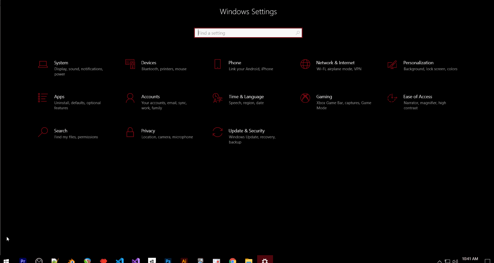

## What is SSH?
SSH or Secure Shell is a cryptographic network protocol for operating network services securely over an unsecured network. Typical 
applications include remote command-line, login, and remote command execution, but any network service can be secured with SSH.

## Installing SSH Server on Linux
[OpenSSH](https://www.openssh.com/) is the tool used for remote login with SSH Protocol. Most Linux Distros have this already installed on their system.
But you can use your favourite package manager to install OpenSSH on your system.
Command to install OpenSSH on Ubuntu:
```bash
sudo apt install openssh-server
```
[Click to see SSH Install Demonstration](sshInstallLinux.jpg)
## Installing SSH Client on Windows 10

To install SSH: click on Start -> Settings Apps -> Apps and Features -> Manage Optional Features. Next locate “OpenSSH Client“, then click “Install“.



## Checking SSH status on Linux
```console
[wilcy@wilcy-pc ~]$ systemctl status sshd
● sshd.service - OpenSSH Daemon
     Loaded: loaded (/usr/lib/systemd/system/sshd.service; enabled; vendor preset: disabled)
     Active: active (running) since Sat 2021-02-27 10:54:21 +0545; 8min ago
   Main PID: 434 (sshd)
      Tasks: 1 (limit: 3563)
     Memory: 3.3M
     CGroup: /system.slice/sshd.service
             └─434 sshd: /usr/bin/sshd -D [listener] 0 of 10-100 startups
```
You can also start,stop,restart other services like SSH using <b>systemctl</b> or <b>service</b> command on Linux.

## Connecting to Linux PC from Windows 10 using SSH
open command prompt on Windows -> follow the below steps -> write the linux root password when prompted
```console
Microsoft Windows [Version 10.0.19042.844]
(c) 2020 Microsoft Corporation. All rights reserved.

C:\Users\wilso>ssh wilcy@wilcy-pc
wilcy@wilcy-pc's password:
Last login: Sat Feb 27 11:23:29 2021 from fe80::c006:25e:86e2:f29%enp3s4
Last login: Sat Feb 27 11:23:29 2021 from fe80::c006:25e:86e2:f29%enp3s4
[wilcy@wilcy-pc ~]$ neofetch
                     ./o.                  wilcy@wilcy-pc
                   ./sssso-                --------------
                 `:osssssss+-              OS: EndeavourOS Linux x86_64
               `:+sssssssssso/.            Kernel: 5.11.1-arch1-1
             `-/ossssssssssssso/.          Uptime: 30 mins
           `-/+sssssssssssssssso+:`        Packages: 1133 (pacman)
         `-:/+sssssssssssssssssso+/.       Shell: bash 5.1.4
       `.://osssssssssssssssssssso++-      Terminal: /dev/pts/1
      .://+ssssssssssssssssssssssso++:     CPU: Intel Core 2 Duo E6750 (2) @ 2.133GHz
    .:///ossssssssssssssssssssssssso++:    GPU: NVIDIA GeForce GT 610
  `:////ssssssssssssssssssssssssssso+++.   Memory: 504MiB / 2985MiB
`-////+ssssssssssssssssssssssssssso++++-
 `..-+oosssssssssssssssssssssssso+++++/`
   ./++++++++++++++++++++++++++++++/:.
  `:::::::::::::::::::::::::------``

[wilcy@wilcy-pc ~]$
```


Here, <b>wilcy</b> is the Linux username and <b>wilcy-pc</b> is the hostname of the Linux System.
Type the following commands on your Linux System to know about hostname and username.
```console
[wilcy@wilcy-pc ~]$ whoami
wilcy
[wilcy@wilcy-pc ~]$ hostname
wilcy-pc
```


